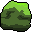
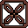

# Pebble Match 🪨

## About

Pebble Match is a short match-3 game in which you collect ores to advance to the next level.
Play and share your highscores on [itch.io](https://honeycodes.itch.io/pebble-match)!

This is my first game in Godot.

### Obstacles

-  Moss grows if it's left unchecked
-  Chains restrict movement
-  Ice, it's just a glaze of frozen water

## Credits

Music: [Abstraction](http://www.abstractionmusic.com/)

Cave tileset: [szadiart](https://szadiart.itch.io/)
